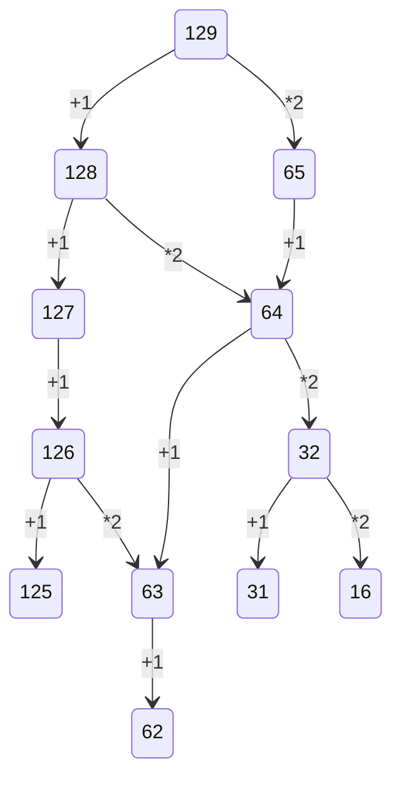

# Бельков Слава
40стр.xlsx - Перевод в 10 в Excel        
из10.py - Перевод из 10 на Python        
50стр.xlsx - Таблица умножения для 8 системы в Excel            
морзе.py - Азбука Морзе на Python          
Логика.xlsx - Логическая таблица       
изображение_2022-10-13_095737192.png - результат обучения нейросети          
решение логической задачи. py — решение логической задачи на Python     
40стр.py - Перевод в 10 на Python      
51стр.py - Таблица умножения на Python          
КодХемминга.ipynb- Код Хемминга      
Морзе.xlsx - Азбука Морзе в Excel       
3 (1).xlsx - Решение задачи из ЕГЭ        
Спецоперация на Украине.png - заставка на компьютере              
$$A\vee \left( A\wedge B \right)=A$$        
Видосик по инфе (и для проекта) - видос, который возможно понадобится

Dillinger is currently extended with the following plugins.
Instructions on how to use them in your own application are linked below.

| задачи | ответы |
| ------ | ------ |
| 19 | 64 |
| 20 | ответ:32,64 |
| 21 | ответ:62 |

